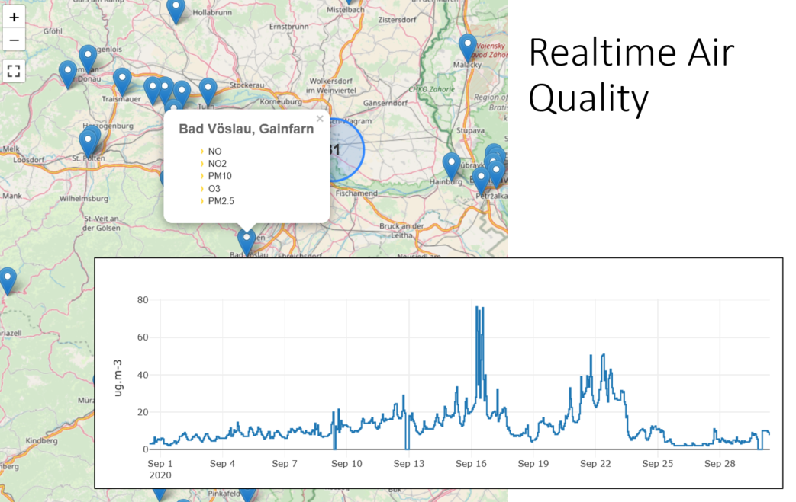

# ELISE Workshop: SensorThings API brings Dynamic Data to INSPIRE

*19th of November, 2020, 14:00 - 18:00 CET.*  
**What is Dynamic Data, why is it a valuable enrichment of an SDI and what benefits does it provide?**

## Overview

Dynamic data pertaining to the state of spatial objects has long been a part of the spatial data ecosystem, enriching more static data holdings with up-to-date observations and measurements pertaining to these objects to provide a more complete picture of the real world.
This trend has been rapidly gaining momentum through the development of the Internet-of-Things (IoT), as more and more real-world-objects become digitally enabled, generating massive amounts of data on our world.

While initially designed to integrate concepts from the IoT into spatial data exchange, the OGC SensorThings API (STA) has been shown to be an effective way of structuring and providing data from a wide range of domains far beyond classical sensor measurements.
Within the INSPIRE Community, STA has achieved candidate Good Practice status.
Due to the highly flexible underlying core observational data model, concepts stemming from different domains become comparable and interoperable.

Envision a world where the spatial data you require is easily discoverable, accessible and combinable.
In order to illustrate this world, we have created a set of STA endpoints, both from more traditional measurement domains as well as novel applications of STA, providing detailed up-to-date data pertaining to the current Covid-19 crisis as follows:

- European Air Quality: hourly measurements of the major air pollutants from stations across Europe.  
  Source: EEA and national endpoints
- Covid-19 Case Data: daily results pertaining to new cases, deaths and recoveries worldwide.  
  Source: Johns Hopkins GitHub and Robert Koch Institute (DE)
- European Demography: population values pertaining to NUTS regions at levels 0 to 3.  
  Source: Eurostat

## Contents

During this workshop, leading experts will introduce you to the potential provided by this new technology.
Kathi Schleidt (INSPIRE Expert, co-chair of the OGC O&M SWG) from DataCove e.U. and
Hylke van den Schaaf (SensorThings Expert, co-chair of the OGC SensorThings API SWG)
from Fraunhofer IOSB will guide you through the following topics:

- SensorThings Basics: the background, functionality, interaction patterns.
  A high level overview showing how to unlock the potential of this new technology
- SensorThings Deployment: how to integrate STA into your existing data landscape,
  what technological options are available, what workflows are best suited for seamless data provision.
- SensorThings Usage: with the endpoints described above and utilizing STAM (DataCove SensorThings Mapper),
  the participants will be guided through the process of creating a simple STA viewer, requiring just a text editor (for example Notepad++ for Windows users) and a web browser.

After this Webinar, participants should have all the knowledge required to evaluate and decide for which of their data holdings the use of STA would be advantageous, as well as understanding how to utilize STA endpoints within various types of applications.

This Webinar Workshop has been designed to address a wide range of participants.
We first provide a high level overview of the power of SensorThings API, suitable to a wide audience interested at understanding more about the potential of this technology.
After this one hour introductory block, we will take a short break before delving deeper into the technicalities of API deployment and use - less technical participants may wish to only attend the first block.

## Agenda

The workshop will be held at the 19th of November, 2020, and start at 14:00 CET.

14:00 SensorThings API & INSPIRE
- Background
  - API4INSPIRE
    - Evaluation Methodology
  - ELISE
- Data Model
  - alignment with INSPIRE EF
- Request Patterns
  - STA as Download Service
- Discussion

*[5 min break]*  
14:50 STA Deployment
- Implementation overview
- FROST-Server: Tomcat or Docker
- Setting up basic objects
- Inserting Observations
- Importing existing data sets
- Questionnaire Deployment

*[15 min break]*  
16:00 STA Use
- Detailed STA Requests (filter, select, expand)
- Integration into viewers - Use STAM 
- Build your own map
- Questionnaire Usage

Feedback - Discussion

## Registration

Registration to the ELISE Workshop: SensorThings API brings Dynamic Data to INSPIRE is open for everyone at:

[https://us02web.zoom.us/meeting/register/tZUldeCorzspHdyfW9iNa8k5yx9nET0rC9VC](https://us02web.zoom.us/meeting/register/tZUldeCorzspHdyfW9iNa8k5yx9nET0rC9VC)

There are no costs for participating in this workshop.

